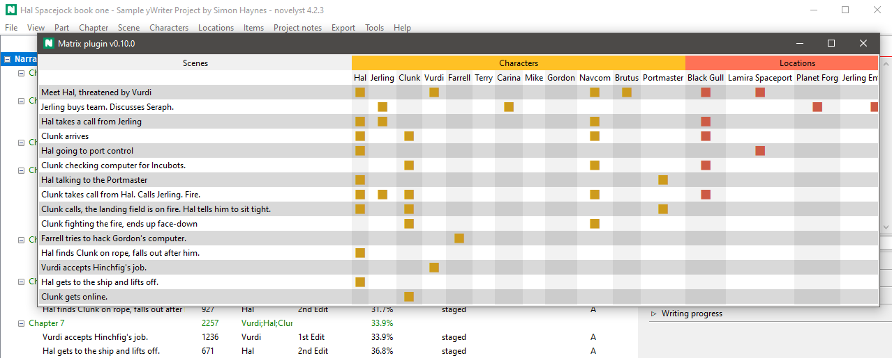

# novelyst_matrix

The [novelyst](https://peter88213.github.io/novelyst/) Python program helps authors organize novels.  

*novelyst_matrix* is a plugin providing a scene relationship matrix. 

## Features

- The plugin adds a "Matrix" entry to the *novelyst* "Tools" menu.
- Display scene relationships to characters, locations, items, and arcs with a spreadsheet-like matrix.
- Add/Remove relationships by klicking on the nodes.

## Requirements

- [novelyst](https://peter88213.github.io/novelyst/) version 4.0+

## Download and install

[Download the latest release (version 0.1.1)](https://github.com/peter88213/novelyst_matrix/raw/main/dist/novelyst_matrix_v0.1.1.zip)

- Unzip the downloaded zipfile "novelyst_matrix_v0.1.1.zip" into a new folder.
- Move into this new folder and launch **setup.pyw**. This installs the plugin for the local user.
- Open "README.md" for usage instructions.

### Note for Linux users

Please make sure that your Python3 installation has the *tkinter* module. On Ubuntu, for example, it is not available out of the box and must be installed via a separate package. 

------------------------------------------------------------------

[Changelog](changelog)

## Usage

See the [instructions for use](usage)

## License

This is Open Source software, and the *novelyst_matrix* plugin is licenced under GPLv3. See the
[GNU General Public License website](https://www.gnu.org/licenses/gpl-3.0.en.html) for more
details, or consult the [LICENSE](https://github.com/peter88213/novelyst_matrix/blob/main/LICENSE) file.
